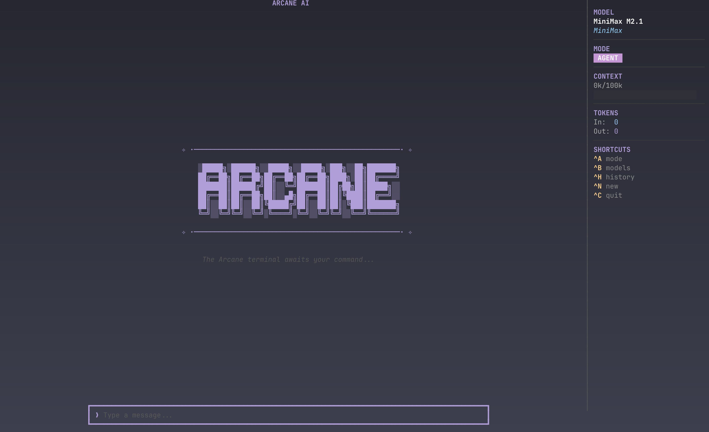

# Arcane



A minimal AI chat TUI built with Go using the [Bubble Tea](https://github.com/charmbracelet/bubbletea) framework.


## Features

- **Agent Mode**: Full access to your file system, shell commands, and codebase.
- **Chat Mode**: Minimal AI chat TUI built with Bubble Tea for quick queries.
- Clean, responsive terminal interface with Markdown rendering
- Multi-model AI support with 7 different models to choose from
- Interactive model selector modal with provider color coding
- Theme-aware background colors for light/dark terminals
- Conversation history with token usage tracking
- Scrollable chat viewport with styled messages
- Optimized startup time
- Persistent chat history stored locally (SQLite)
- Interactive chat history viewer to resume past conversations

## Installation

```bash
git clone https://github.com/bm611/arcane.git
cd arcane
go mod tidy
go build -o arcane
```

## Usage

Set your OpenRouter API key:

```bash
export OPENROUTER_API_KEY="your-api-key"
```

Run the application:

```bash
./arcane
```

## Modes

- **Chat Mode** (Default): Run `./arcane` for a standard AI chat interface.
- **Agent Mode**: Run `./arcane --agent` to give the AI access to read/edit files and execute bash commands in your current directory.

## Keyboard Shortcuts

| Key | Action |
|-----|--------|
| `Enter` | Send message |
| `Ctrl+B` | Toggle model selector modal |
| `Ctrl+H` | Toggle chat history |
| `↑` / `↓` | Navigate model/history selector (when open) |
| `Ctrl+N` | Start new chat session |
| `Ctrl+C` / `Esc` | Quit (or close modal) |

You can also type `/clear` or `/reset` to start a new session.

## Dependencies

- [Bubble Tea](https://github.com/charmbracelet/bubbletea) - TUI framework
- [Lip Gloss](https://github.com/charmbracelet/lipgloss) - Terminal styling
- [Glamour](https://github.com/charmbracelet/glamour) - Markdown rendering
- [OpenAI Go SDK](https://github.com/openai/openai-go) - API client (used with OpenRouter)

## License

MIT
